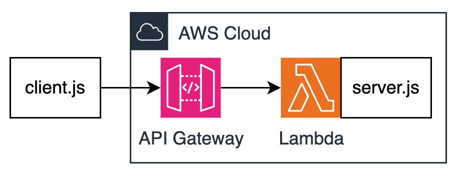

# Deploying Bedrock usage logs MCP Server on AWS Lambda

This project deploys a Model Context Protocol (MCP) server as a containerized application on AWS Lambda, accessible via API Gateway.

## Architecture

The following diagram illustrates the architecture of the MCP server deployment:



The architecture consists of:
1. **API Gateway**: Provides the HTTP API endpoint
2. **Lambda Function**: Runs the containerized MCP server
3. **ECR**: Stores the Docker container image
4. **CloudWatch Logs**: Collects and stores logs from both the server and Bedrock usage
5. **Bedrock**: The underlying model service that the MCP server interacts with

## Prerequisites

1.  **Node.js & npm:** Install Node.js version 18.x or later (which includes npm). This is required for running the server and client locally.
2.  **Python 3.x:** Required for the deployment script (`deploy.py`).
3.  **Docker:** Install Docker Desktop or Docker Engine. Required for building the container image for AWS Lambda deployment.
4.  **AWS Account & CLI:** Required for deployment:
    *   An active AWS account
    *   AWS CLI installed and configured with appropriate credentials
    *   Boto3 Python package: `pip install boto3`

Note: For local development and testing, you only need Node.js and npm. The other prerequisites are only required if you plan to deploy to AWS.

## Running Locally

You can run both the server and client locally for development and testing purposes.

### Running the Server Locally

1. Install dependencies:
   ```bash
   npm install
   ```

2. Start the server:
   ```bash
   npx tsx src/server.ts
   ```
   The server will start on `http://localhost:3000` by default.

### Running the Client Locally

1. The client can be run using the same command:
   ```bash
   npx tsx src/client.ts
   ```

Example:
```bash
# Initialize
curl -XPOST "http://localhost:3000/prod/mcp" \
-H "Content-Type: application/json" \
-H "Accept: application/json" \
-d '{
  "jsonrpc": "2.0",
  "method": "initialize",
  "params": {
    "clientInfo": { "name": "curl-client", "version": "1.0" },
    "protocolVersion": "2025-03-26",
    "capabilities": {}
  },
  "id": "init-1"
}'
```

## Deployment Approach

*   **Container Image:** The Node.js/Express application is packaged into a Docker container image using Node.js 18.
*   **AWS ECR:** The Docker image is stored in Amazon Elastic Container Registry (ECR).
*   **AWS Lambda:** A Lambda function is created using the container image from ECR.
*   **API Gateway:** An HTTP API is created with API key authentication and usage plans.
*   **CloudWatch Logs:** The server integrates with CloudWatch Logs for monitoring and debugging.

## Available Tools

The server implements the following tools:

1. **greet**: A simple greeting tool that returns a personalized message
2. **multi-greet**: A tool that sends multiple greetings with delays between them
3. **bedrock-logs**: A tool for querying AWS Bedrock usage logs

## Deployment Steps


1.  **Run the Deployment Script:**
    ```bash
    python deploy.py \
      --function-name mcp-server-function \
      --role-arn arn:aws:iam::<your-account-id>:role/mcp-lambda-execution-role \
      --bedrock-role-arn arn:aws:iam::<your-account-id>:role/mcp-bedrock-role \
      --region us-east-1 \
      --memory 2048 \
      --timeout 300 \
      --api-gateway \
      --api-name mcp-server-api \
      --stage-name prod
    ```

    The script will:
    *   Build the Docker image for the correct Lambda architecture (`linux/amd64`)
    *   Create the ECR repository if it doesn't exist
    *   Authenticate Docker with ECR
    *   Push the image to ECR
    *   Create the Lambda execution IAM role and attach policies
    *   Create or update the Lambda function
    *   Create or update the API Gateway with API key authentication
    *   Set up usage plans and throttling

2.  **Deployment Output:**
    *   Upon successful completion, the script will print a summary including:
        *   ECR Image URI
        *   IAM Role ARN
        *   Lambda Function ARN
        *   API Gateway URL
        *   API Key

## Connecting to the Server

After deployment, you can connect to the server using the `client.ts` script:

1. Set the required environment variables:
   ```bash
   export MCP_SERVER_URL="https://<api-id>.execute-api.<region>.amazonaws.com/prod/mcp"
   ```
2. Install dependencies:
    ```bash
    npm install
    ```

2. Run the client:
   ```bash
   npx tsx src/client.ts
   ```

The client will automatically:
- Initialize a connection with the server
- Handle session management
- Provide an interactive interface for using the available tools


## Known issues:
- Client sometimes fails to call tools, this can be resolved by restarting the client or establishing connection again.