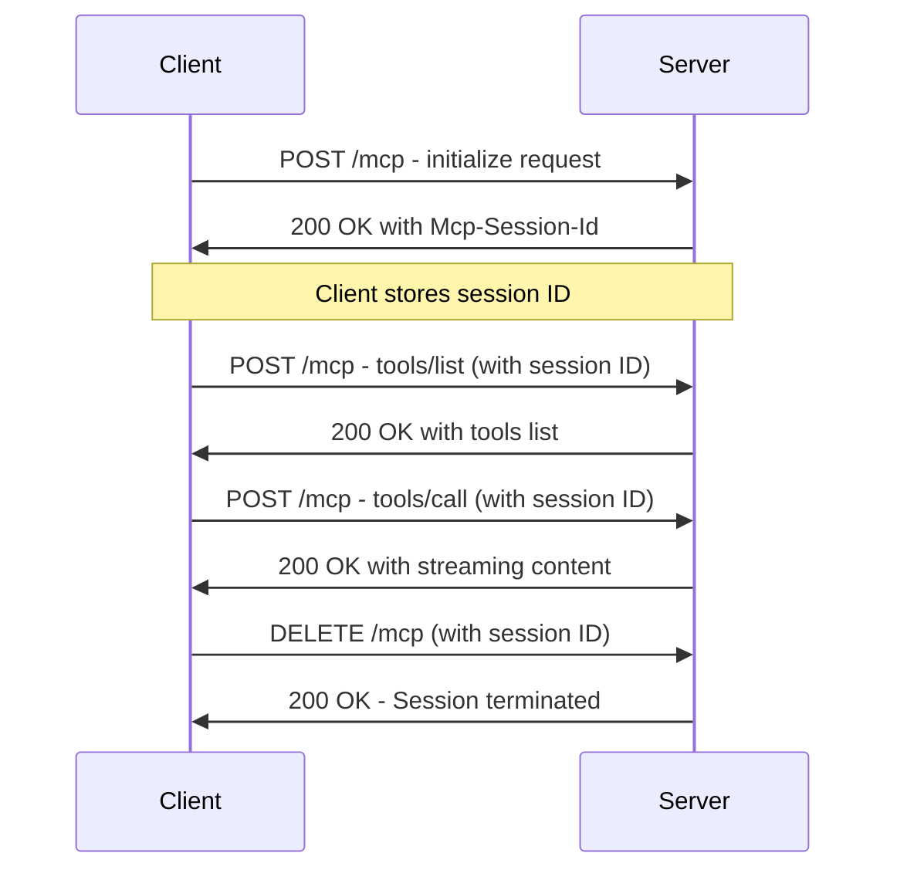
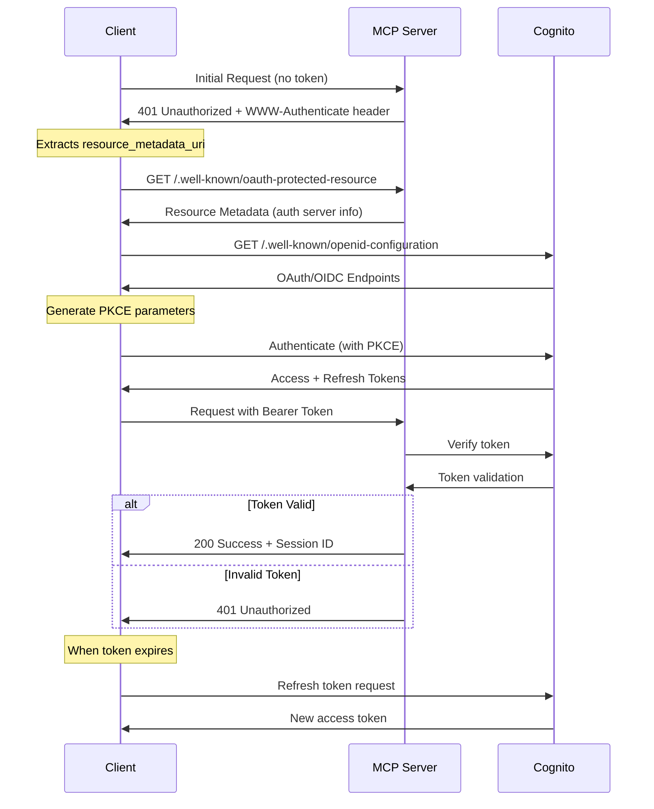

# Streamable MCP Server on AWS Lambda with OAuth 2.1 Authorization

This project implements a Model Context Protocol (MCP) server as a containerized application on AWS Lambda, accessible via Amazon API Gateway. It showcases the [`Streamable-HTTP`](https://modelcontextprotocol.io/specification/2025-03-26/basic/transports#streamable-http) transport along with OAuth 2.1 authorization through AWS Cognito, providing a fully standards-compliant implementation.

The MCP server in this repo:
- Uses session management via the `Mcp-Session-id` header
- Implements OAuth 2.1 authorization at the transport layer
- Provides tools to analyze Amazon Bedrock usage

Both server and client are written in TypeScript, with the server deployed as a container on Lambda.

>Note: As of 4/22/2025 Lambda supports HTTP Streaming for Node.js managed runtime ([documentation](https://docs.aws.amazon.com/lambda/latest/dg/configuration-response-streaming.html)). This implementation leverages that capability to create a fully serverless MCP deployment.

## Key Features

- **Standards Compliance**: Implements both Streamable-HTTP transport and OAuth 2.1 authorization specs
- **Serverless Deployment**: Runs on AWS Lambda and API Gateway for scalability
- **Secure Authentication**: Uses AWS Cognito for OAuth 2.1 authentication
- **Discovery Support**: Implements OAuth discovery flow per RFC9728
- **Analytics Tool**: Provides Bedrock usage analysis tool

## Architecture


*Image credit: [https://github.com/aal80/simple-mcp-server-on-lambda](https://github.com/aal80/simple-mcp-server-on-lambda)*

The architecture consists of:
1. **API Gateway**: HTTP API endpoint with streaming support
2. **Lambda Function**: Containerized MCP server with OAuth authorization
3. **ECR**: Container storage
4. **Cognito**: OAuth 2.1 authentication provider
5. **CloudWatch Logs**: Server and Bedrock usage logging
6. **Bedrock**: The foundation model service

## Prerequisites

1. **Node.js & npm:** v18.x or later
2. **Python 3.11:** For the deployment script
3. **Docker:** For container building
4. **AWS Account & CLI:** With appropriate credentials
5. **CloudWatch Setup:** [Model invocation logs](https://docs.aws.amazon.com/bedrock/latest/userguide/model-invocation-logging.html#setup-cloudwatch-logs-destination) configured
6. **IAM Permissions:** 
   - CloudWatch Logs read access ([CloudWatch Logs Read-Only Access](https://docs.aws.amazon.com/aws-managed-policy/latest/reference/CloudWatchLogsReadOnlyAccess.html))
   - Cost Explorer read access ([Billing policy examples](https://docs.aws.amazon.com/awsaccountbilling/latest/aboutv2/billing-example-policies.html))

## Quick Start Guide

### Local Development

1. **Install dependencies:**
   ```bash
   npm install
   ```

2. **Start the server locally:**
   ```bash
   npx tsx src/server.ts
   ```
   The server will start on `http://localhost:3000` by default.

3. **Run the client in another terminal:**
   ```bash
   npx tsx src/client.ts
   ```

4. **Optional authentication:**
   ```bash
   # In the client, authenticate with:
   > auth login
   ```

### AWS Deployment

1. **Install Python dependencies:**
   ```bash
   # Install uv
   curl -LsSf https://astral.sh/uv/install.sh | sh
   export PATH="$HOME/.local/bin:$PATH"

   # Create a virtual environment and install dependencies
   uv venv --python 3.11 && source .venv/bin/activate && uv pip install --requirement pyproject.toml
   ```

2. **Configure AWS Cognito:**
   - Create a User Pool in AWS Cognito Console
   - Create an App Client with authorization code grant flow
   - Configure callback URL (typically http://localhost:8000/callback)
   - Add allowed scopes: openid, profile

3. **Set environment variables:**
   ```bash
   # Server environment variables
   export COGNITO_REGION="us-east-1"
   export COGNITO_USER_POOL_ID="<your-user-pool-id>"
   export COGNITO_ALLOWED_CLIENT_IDS="<your-client-id>"
   
   # COGNITO_DOMAIN can be either full domain or just the prefix
   # Full domain example:
   export COGNITO_DOMAIN="<your-domain>.auth.us-east-1.amazoncognito.com"
   # Or just the prefix (domain part will be built automatically):
   export COGNITO_DOMAIN="<your-domain>"
   
   # Client environment variables
   export OAUTH_CLIENT_ID="<your-client-id>"
   export OAUTH_REDIRECT_URI="http://localhost:8000/callback"
   ```

4. **Run deployment script:**
   ```bash
   python deploy.py \
     --function-name mcp-server \
     --role-arn <lambda-execution-role-arn> \
     --region us-east-1 \
     --memory 2048 \
     --timeout 300 \
     --api-gateway \
     --api-name mcp-server-api \
     --stage-name prod \
     --cognito-user-pool-id <your-user-pool-id> \
     --cognito-domain <your-domain-prefix> \
     --cognito-client-ids <your-client-id>
   ```

5. **Connect client to deployed server:**
   ```bash
   export MCP_SERVER_URL="https://<api-id>.execute-api.<region>.amazonaws.com/prod/mcp"
   npx tsx src/client.ts
   
   # At the client prompt
   > auth login
   > connect
   ```

## MCP Protocol Implementation

This project implements two key MCP specifications:

1. **Streamable-HTTP Transport** - Enables stateful connections over HTTP with session management
2. **OAuth 2.1 Authorization** - Secures API access with standards-compliant authorization

### Streamable-HTTP Sequence Diagram



### OAuth 2.1 Authorization Flow



## Authentication Setup

### Configuring AWS Cognito

1. **Create a Cognito User Pool** in the AWS Console
2. **Create an App Client:**
   - Set Authorization code grant flow
   - Add allowed scopes: openid, profile
   - Configure callback URL as http://localhost:8000/callback

### Client Authentication Commands

```bash
# Login with OAuth 2.1 (with PKCE)
> auth login

# Check authentication status
> auth status

# Manually refresh token
> auth refresh

# Log out
> auth logout
```

### Authentication Features

- **OAuth 2.1 Compliance**: Standards-compliant authorization
- **PKCE Support**: Enhanced security for public clients
- **JWT Verification**: Token verification via JWKS
- **Token Refresh**: Automatic refresh with rotation
- **Discovery**: RFC9728-compliant OAuth discovery with Cognito-specific adaptations
- **Graceful Fallbacks**: Robust error handling with multiple discovery mechanisms

## Using the Bedrock Report Tool

```bash
# Default parameters (us-east-1, standard log group, 1 day)
> bedrock-report

# Custom parameters
> bedrock-report us-east-1 /aws/bedrock/modelinvocations 7 123456789012
```

This will produce a detailed report showing:
- Total requests, tokens, and usage
- Daily breakdowns
- Regional summaries
- Model-specific usage
- User/role summaries

Example output:
```
Tool result:
Bedrock Daily Usage Report (Past 7 days - us-east-1)
Total Requests: 13060
Total Input Tokens: 2992387
Total Completion Tokens: 254124
Total Tokens: 3246511

--- Daily Totals ---
2025-04-06: Requests=8330, Input=1818253, Completion=171794, Total=1990047
2025-04-07: Requests=4669, Input=936299, Completion=71744, Total=1008043
...

--- Model Summary ---
nova-lite-v1:0: Requests=93, Input=177416, Completion=30331, Total=207747
titan-embed-text-v1: Requests=62, Input=845, Completion=0, Total=845
...
```

## Available MCP Tools

The server implements these tools:

1. **greet**: A simple greeting tool that returns a personalized message
2. **multi-greet**: A tool that sends multiple greetings with delays
3. **get_bedrock_usage_report**: A comprehensive Bedrock usage analysis tool

## Client Command Reference

| Command | Description |
|---------|-------------|
| `connect [url]` | Connect to MCP server (default or specified URL) |
| `disconnect` | Disconnect from server |
| `terminate-session` | Terminate the current session |
| `reconnect` | Reconnect to the server |
| `list-tools` | List available tools on the server |
| `call-tool <n> [args]` | Call a tool with optional JSON arguments |
| `greet [name]` | Call the greet tool with optional name |
| `multi-greet [name]` | Call the multi-greet tool with notifications |
| `list-resources` | List available resources |
| `bedrock-report [region] [log_group] [days] [account_id]` | Get Bedrock usage report |
| `auth login` | Authenticate with the MCP server using OAuth 2.1 |
| `auth logout` | Clear the stored token |
| `auth status` | Show current authentication status |
| `auth refresh` | Force refresh the access token |
| `debug on off` | Enable or disable debug logging |
| `help` | Show help information |
| `quit` | Exit the program |

## Advanced Usage

### Direct API Calls with curl

```bash
# Replace with your access token if using authentication
curl -XPOST "https://<api-id>.execute-api.<region>.amazonaws.com/prod/mcp" \
  -H "Content-Type: application/json" \
  -H "Accept: application/json, text/event-stream" \
  -H "Authorization: Bearer <access-token>" \
  -d '{
    "jsonrpc": "2.0",
    "method": "initialize",
    "params": {
      "clientInfo": { "name": "curl-client", "version": "1.0" },
      "protocolVersion": "2025-03-26",
      "capabilities": {}
    },
    "id": "init-1"
  }' | cat
```

### Environment Variables

#### Server Variables
- `COGNITO_REGION`: AWS region where Cognito is deployed
- `COGNITO_USER_POOL_ID`: ID of the Cognito user pool
- `COGNITO_ALLOWED_CLIENT_IDS`: Comma-separated list of allowed client IDs
- `COGNITO_DOMAIN`: Cognito domain for the user pool (can be full domain like "my-domain.auth.region.amazoncognito.com" or just the prefix like "my-domain")

#### Client Variables
- `MCP_SERVER_URL`: URL of the MCP server
- `OAUTH_CLIENT_ID`: Cognito app client ID
- `OAUTH_REDIRECT_URI`: Redirect URI for OAuth flow
- `MCP_CLIENT_DEBUG`: Set to 'true' to enable debug logging
- `ACCESS_TOKEN`: Directly provide an access token (optional)

## Troubleshooting

### Common Issues

1. **Authentication Failures**:
   - Ensure Cognito user pool and client IDs are correctly configured
   - Verify the user credentials being used
   - Try `auth refresh` or `auth login` to obtain fresh tokens
   - Check Cognito domain format - either provide the full domain (e.g., "my-domain.auth.us-east-1.amazoncognito.com") or just the prefix (e.g., "my-domain")
   - If you see DNS errors like "getaddrinfo ENOTFOUND", check that your domain format is correct; for user pool IDs with format "region_ID", the correct domain prefix is "region-id" (lowercase with hyphen)
   - Note that Cognito uses a different OpenID discovery URL format than standard OAuth providers; this implementation handles this automatically by trying both formats

2. **Connection Problems**:
   - Verify the server URL is correct with proper `/mcp` suffix
   - Check network connectivity to the API Gateway endpoint
   - Ensure AWS region is correctly specified in environment variables

3. **Permission Errors**:
   - Verify Lambda has appropriate IAM permissions for CloudWatch Logs access
   - Check that the user/role has Cost Explorer permissions

4. **Deployment Issues**:
   - Ensure Docker is running and properly configured for `linux/amd64` builds
   - Check that AWS CLI has necessary permissions for ECR, Lambda, and API Gateway

### Debug Mode

Enable debug logging to troubleshoot connection issues:

```bash
# In client:
> debug on

# Or as environment variable:
export MCP_CLIENT_DEBUG=true
```

## Project Structure

- `/src/server.ts` - MCP server implementation
- `/src/client.ts` - MCP client with OAuth support
- `/src/auth/` - Authorization components
  - `cognito.ts` - JWT verification logic
  - `oauthMetadata.ts` - OAuth resource metadata
  - `oauth2Client.ts` - OAuth client implementation

## Known Issues

- Client occasionally fails to call tools, which can be resolved by reconnecting or restarting
- Token refresh may sometimes require manual intervention with `auth refresh`
- Large responses from the Bedrock usage tool may be truncated in certain environments

## Acknowledgments

This project was developed with the support of:

- [Model Context Protocol](https://modelcontextprotocol.io/) for the communication protocol
- [AWS Lambda](https://aws.amazon.com/lambda/) for serverless computing
- [Amazon API Gateway](https://aws.amazon.com/api-gateway/) for API management
- [Amazon Bedrock](https://aws.amazon.com/bedrock/) for foundation models
- [Amazon Cognito](https://aws.amazon.com/cognito/) for authentication
- [Node.js](https://nodejs.org/) and [TypeScript](https://www.typescriptlang.org/) for implementation
- [Express.js](https://expressjs.com/) for the web server framework

## License

This project is licensed under the terms in the LICENSE file included in this repository.